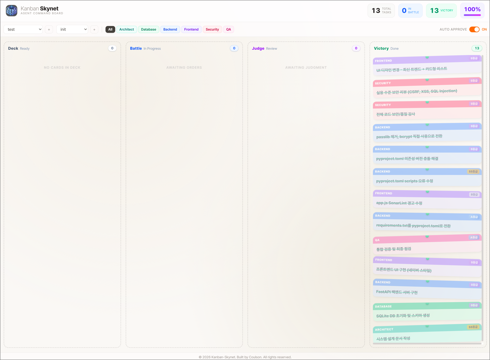
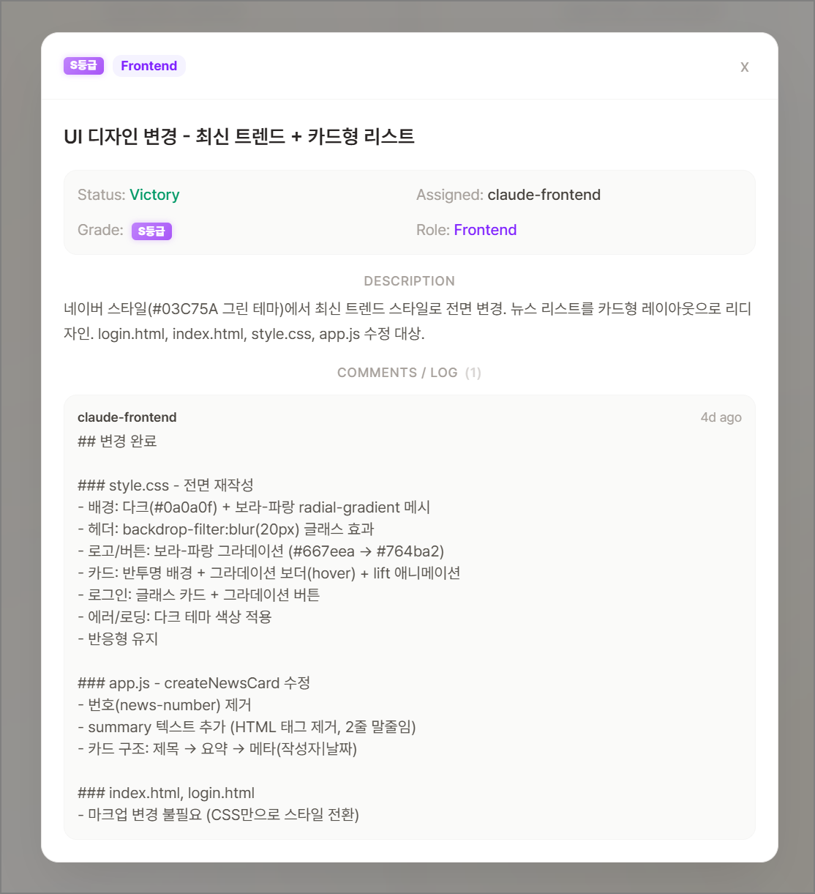

# Kanban Skynet

**Claude Code 에이전트 팀**의 작업 과정을 영속적으로 기록하고 시각화하는 칸반보드 시스템.

로컬에 띄워서 혼자 쓸 수도 있고, 사내 서버에 배포해서 팀원들과 함께 모니터링할 수도 있다.

> **전제 조건**: [Claude Code](https://docs.anthropic.com/en/docs/claude-code)가 설치되어 있고, 에이전트 팀 기능(`@agent-name` 호출)을 사용할 수 있는 환경이 필요하다.

## 스크린샷





## 배경

Claude Code 에이전트 팀에게 일을 시키면 일은 한다. 하지만 두 가지 문제가 있다:

1. **세션이 휘발된다.** 에이전트 세션이 끝나거나 컨텍스트가 초과되면 작업 과정이 전부 사라진다. 누가 뭘 했는지, 왜 막혔는지, 어떤 순서로 진행됐는지 추적할 수 없다.

2. **진행 상황을 파악하기 어렵다.** 에이전트 한 명이든 여러 명이든, 터미널 로그만으로는 전체 진행 상황을 한눈에 보기 어렵다.

Kanban Skynet은 이 문제를 해결한다:

- 모든 태스크의 상태 전환, 담당 에이전트, 코멘트, 의존관계가 **DB에 영속적으로 기록**된다
- 칸반 보드에서 전체 작업 흐름을 **실시간으로 시각화**한다
- 세션이 100번 날아가도 작업 히스토리는 그대로 남아있다

## 동작 방식

사용자가 하는 일은 **Claude Code 프롬프트 창에서 에이전트에게 요청하는 것**뿐이다. 웹 UI는 모니터링 도구로, 작업 진행 상황을 실시간으로 확인하는 용도다. 로컬에 띄워서 혼자 쓸 수도 있고, 사내 서버에 배포해서 팀원들과 공유할 수도 있다.

```
사용자 (Claude Code 프롬프트)
  "@ks-orchestrator 로그인 기능 만들어줘"
       |
Orchestrator 에이전트
  1. 워크스페이스/프로젝트 목록 조회 후 사용자에게 확인
  2. 플랜 수립 + 서브 태스크 생성 (Auto Approve OFF면 사용자 승인 후 생성)
       |
역할별 에이전트 (ARCHITECT/DATABASE/BACKEND/FRONTEND/SECURITY/QA)
  3. MCP로 태스크를 가져가 작업 (Ready -> In Progress -> Review)
  4. QA 에이전트 검수 -> Done
       |
웹 UI 칸반 보드
  사용자는 브라우저에서 전체 진행 상황을 실시간으로 모니터링
```

모든 에이전트는 MCP(Model Context Protocol)를 통해 칸반 서버와 통신한다. 태스크를 가져가고, 상태를 변경하고, 코멘트를 남기는 모든 행위가 API를 통해 이루어지므로 자동으로 기록된다.

## 주요 기능

- **칸반 보드**: 4개 컬럼(Ready, In Progress, Review, Done)으로 작업 현황 한눈에 파악
- **실시간 업데이트**: WebSocket으로 에이전트의 작업 진행이 즉시 반영
- **의존관계 관리**: 태스크 간 의존관계 설정, 선행 태스크 미완료 시 자동 차단
- **역할 기반 필터**: ARCHITECT/DATABASE/BACKEND/FRONTEND/SECURITY/QA별 필터링
- **Auto Approve**: ON이면 오케스트레이터가 플랜 수립 후 즉시 서브 태스크 생성, OFF면 사용자 승인 후 생성
- **작업 히스토리**: 모든 상태 전환, 코멘트, blocked 사유가 태스크 단위로 영구 보존
- **Done 검색/페이지네이션**: 완료된 태스크가 수백 개여도 검색과 페이지 네비게이션으로 빠르게 탐색

## 기술 스택

| 영역 | 기술 |
|------|------|
| 서버 | Next.js 16 Custom Server + Hono 4 |
| 프론트엔드 | React 19 + Next.js App Router + Tailwind CSS 4 |
| DB | SQLite (better-sqlite3) + WAL 모드 |
| MCP | Streamable HTTP - Stateless (@modelcontextprotocol/sdk) |
| 실시간 | WebSocket (ws) |
| 검증 | Zod 4 |
| 런타임 | TypeScript 5.9 + tsx |
| 배포 | Docker (node:22-alpine, multi-stage) |

## 빠른 시작

### 사전 요구사항

- [Claude Code](https://docs.anthropic.com/en/docs/claude-code) 설치 및 에이전트 팀 기능 활성화
- Node.js 22+ (또는 Docker)

### 방법 1: Docker (권장)

```bash
git clone https://github.com/fallboyz/kanban-skynet.git
cd kanban-skynet
cp .env.example .env
docker compose up -d
```

서버가 `http://localhost:4000`에서 시작된다.

### 방법 2: 직접 실행

```bash
git clone https://github.com/fallboyz/kanban-skynet.git
cd kanban-skynet
npm install
cp .env.example .env
npm run dev
```

### MCP 등록

Claude Code CLI로 칸반 서버를 MCP에 등록한다:

```bash
# 로컬에서 혼자 쓰는 경우
claude mcp add --transport http kanban-skynet http://localhost:4000/mcp -s user

# 사내 공용 서버에 띄운 경우
claude mcp add --transport http kanban-skynet http://<서버IP>:4000/mcp -s user
```

### 에이전트 정의 파일 배치

이 저장소의 `.claude/agents/` 디렉토리를 개발자 프로젝트에 복사한다:

```bash
# 개발자 프로젝트 루트에서
cp -r kanban-skynet/.claude/agents/ .claude/agents/
```

복사되는 파일:

| 파일 | 역할 |
|------|------|
| `ks-orchestrator.md` | PM - 태스크 분배 및 조율 |
| `ks-architect.md` | 시스템 구조, 기술 선택, API 스펙 설계 |
| `ks-database.md` | DB 스키마 설계, 쿼리 최적화 |
| `ks-backend.md` | 서버 구현, API, 비즈니스 로직 |
| `ks-frontend.md` | UI, 컴포넌트, 클라이언트 로직 |
| `ks-security.md` | 보안 취약점 검수, 코드 보안 리뷰 |
| `ks-qa.md` | 기능 검증, 통합 테스트 |

### 사용

Claude Code 프롬프트에서 `@ks-orchestrator`로 Orchestrator 에이전트를 호출한다.

> **주의**: 반드시 `@ks-orchestrator`로 **명시적으로 호출**해야 한다. "칸반 스카이넷으로 만들어줘", "칸반으로 해줘" 같은 자연어 표현은 에이전트가 정확히 인식하지 못할 수 있다.

## 사용 예시

**예시 1: 워크스페이스/프로젝트를 모르는 경우**

```
사용자: @ks-orchestrator 로그인 기능 만들어줘

Orchestrator: 현재 워크스페이스 목록입니다:
  1. my-saas-app
  2. internal-tools
  어떤 워크스페이스에 생성할까요?

사용자: my-saas-app

Orchestrator: my-saas-app의 프로젝트 목록입니다:
  1. auth-system
  2. payment
  어떤 프로젝트에 생성할까요? 새 프로젝트를 만들 수도 있습니다.

사용자: auth-system

Orchestrator: 다음과 같이 플랜을 수립했습니다:
  - ARCHITECT: 인증 시스템 설계
  - DATABASE: 사용자 테이블 스키마
  - BACKEND: 로그인 API 구현
  - FRONTEND: 로그인 폼 UI
  - SECURITY: 인증 로직 보안 검수
  - QA: 로그인 기능 통합 검증
  승인하시겠습니까? (Auto Approve OFF)

사용자: 승인

(이후 각 에이전트가 자동으로 작업 수행 — 웹 UI에서 실시간 모니터링)
```

**예시 2: 워크스페이스/프로젝트를 이미 아는 경우**

```
사용자: @ks-orchestrator my-saas-app의 auth-system 프로젝트에 로그인 기능 만들어줘

Orchestrator: auth-system 프로젝트를 확인했습니다.
  다음과 같이 플랜을 수립했습니다:
  ...
```

**예시 3: 새 프로젝트가 필요한 경우**

```
사용자: @ks-orchestrator 알림 기능 만들어줘. my-saas-app에.

Orchestrator: my-saas-app의 프로젝트 목록입니다:
  1. auth-system
  2. payment
  기존 프로젝트에 추가할까요, 새 프로젝트를 만들까요?

사용자: notification이라는 새 프로젝트 만들어줘

Orchestrator: notification 프로젝트를 생성했습니다. 플랜을 수립합니다...
```

## 환경변수

`.env.example` 참조:

```
PORT=4000
DB_PATH=./data/kanban-skynet.db
```

## 엔드포인트

| 경로 | 설명 |
|------|------|
| `http://localhost:4000` | 웹 UI (칸반 보드) |
| `http://localhost:4000/api/*` | REST API |
| `http://localhost:4000/health` | 헬스체크 |
| `http://localhost:4000/mcp` | MCP (Streamable HTTP) |
| `ws://localhost:4000/ws` | WebSocket (실시간 업데이트) |

## 라이선스

[MIT License](LICENSE)

## 빌더

[Coulson](https://github.com/fallboyz)
